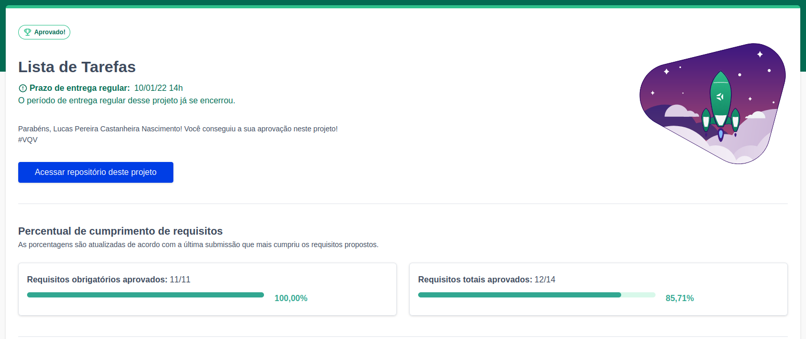
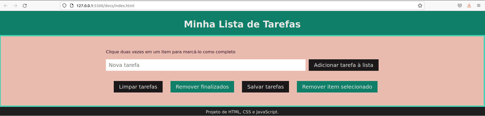

# To-do List

<h2>:brazil: Português :brazil:</h2>

Projeto entregue durante o curso de desenvolvimento Web ministrado pela <a href="https://www.betrybe.com" targe="_blank" rel="nofollow">Trybe</a>.

Obtive a aprovação no projeto, completando 100% dos requisitos obrigatórios e 85,71% levando em conta os requisitos opcionais. Efetivando, assim, a conclusão do Bloco 5 (JavaScript: DOM, Eventos e Web Storage) referente ao Módulo 1 (Fundamentos do Desenvolvimento Web).

Descrição:

O projeto tinha como objetivo desenvolver uma lista de tarefas usando HTML, CSS e JavaScript.

Habilidades desenvolvidas

<ol>
<li>Manipular CSS</li>
<li>Manipular JavaScript</li>
</ol>

Link para conferência: https://lucas-pcn.github.io/to-do-list/

<a href="https://www.linkedin.com/in/lucas-pereira-castanheira-nascimento-238355190/" targe="_blank" rel="nofollow">Meu Linkedin</a>.

 

<h2>:us: English :us:</h2>

Project delivered during the Web development course taught by <a href="https://www.betrybe.com" targe="_blank" rel="nofollow">Trybe</a>.

I passed the project, completing 100% of mandatory and optional requirements. Thus, completing Block 5 (JavaScript: DOM, Events and Web Storage) referring to Module 1 (Fundamentals of Web Development).

Description:

The project aimed to develop a to-do list using HTML, CSS and JavaScript.

Developed skills

<ol>
<li>Manipulate CSS</li>
<li>Manipulate JavaScript</li>
</ol>

Conference link: https://lucas-pcn.github.io/to-do-list/

<a href="https://www.linkedin.com/in/lucas-pereira-castanheira-nascimento-238355190/" targe="_blank" rel="nofollow">My Linkedin</a>.

